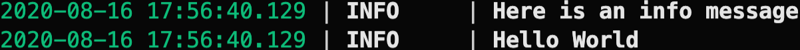
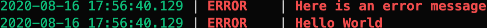
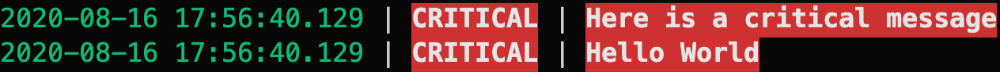

<!-- DO NOT REMOVE - contributor_list:data:start:["Matt-Gleich", "ImgBotApp"]:end -->

# logoru

🌲 golang port of Delgan's python loguru


## 🚀 Install

Run the following command in your terminal:

```txt
go get -u github.com/Matt-Gleich/logoru
```

## 📝 Documentation [](https://godoc.org/github.com/Matt-Gleich/logoru)

### `func Debug`

```go
func Debug(msg string) error
```

Output a debugging message

#### Example

```go
package main


import "github.com/Matt-Gleich/logoru"

func main() {
    logoru.Debug("Here is a debug message")
}
```

Output:


### `func Info`

```go
func Info(msg string) error
```

Output an info message

#### Example

```go
package main


import "github.com/Matt-Gleich/logoru"

func main() {
    logoru.Info("Here is an info message")
}
```

Output:



### `func Success`

```go
func Info(msg string) error
```

Output a success message

#### Example

```go
package main


import "github.com/Matt-Gleich/logoru"

func main() {
    logoru.Success("Here is a success message")
}
```

Output:


### `func Warning`

```go
func Info(msg string) error
```

Output a warning message

#### Example

```go
package main


import "github.com/Matt-Gleich/logoru"

func main() {
    logoru.Warning("Here is a warning message")
}
```

Output:


### `func Error`

```go
func Error(msg string) error
```

Output a error message

#### Example

```go
package main


import "github.com/Matt-Gleich/logoru"

func main() {
    logoru.Error("Here is an error message")
}
```

Output:



### `func Critical`

```go
func Critical(msg string) error
```

Output a critical message

#### Example

```go
package main


import "github.com/Matt-Gleich/logoru"

func main() {
    logoru.Critical("Here is a critical message")
}
```

Output:



## 🙌 Contributing

Before contributing please read the [CONTRIBUTING.md file](https://github.com/Matt-Gleich/logoru/blob/master/CONTRIBUTING.md)

<!-- DO NOT REMOVE - contributor_list:start -->
## 👥 Contributors


- **[@Matt-Gleich](https://github.com/Matt-Gleich)**

- **[@ImgBotApp](https://github.com/ImgBotApp)**

<!-- DO NOT REMOVE - contributor_list:end -->
